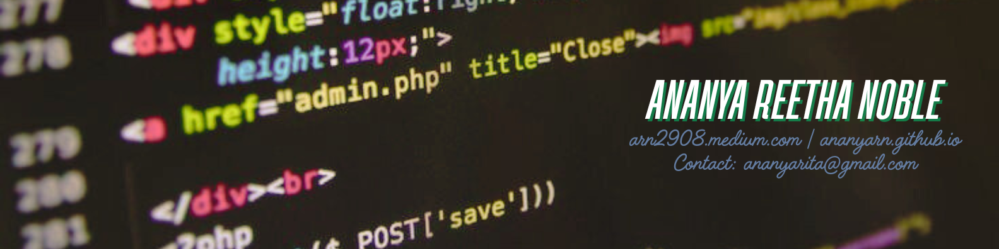

<h1 align="center"> Hey, I'm Ananya Reetha Noble! </h1>

<strong>Computer Science Graduate | Aspiring Researcher | AI/ML Enthusiast | Blogger</strong>

  

### 🔬 Current Focus

- **Project**:
- **Researching**: 
- **Writing**: [Articles on Medium](https://arn2908.medium.com)

---

### 📬 Get in Touch

- 📧 [ananyarita@gmail.com](mailto:ananyarita@gmail.com)
- 💼 [LinkedIn](https://linkedin.com/in/ananya298)
- 🌐 [Portfolio](https://ananyarn.github.io)

---

### 📊 GitHub Stats

  

  

  

<!---
ananyarn/ananyarn is a ✨ special ✨ repository because its `README.md` (this file) appears on your GitHub profile.
You can click the Preview link to take a look at your changes.
--->
